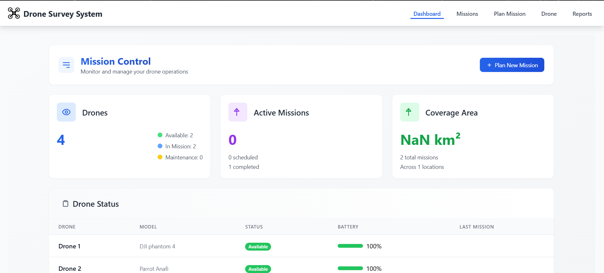
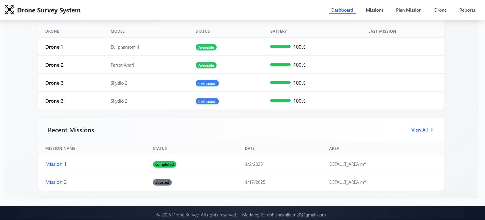
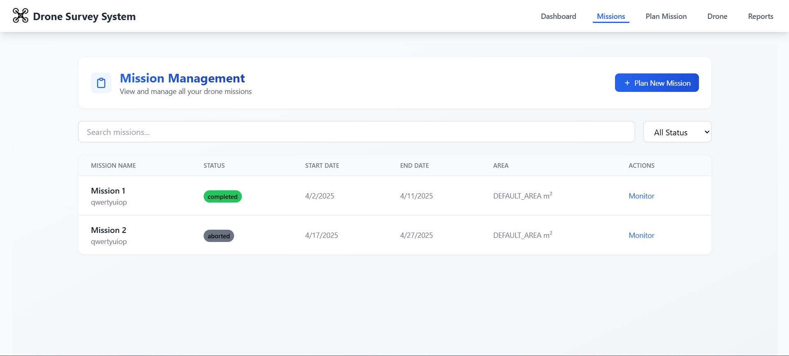
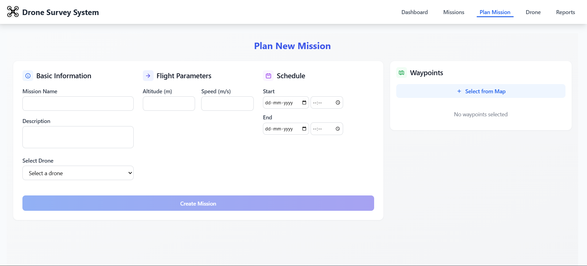
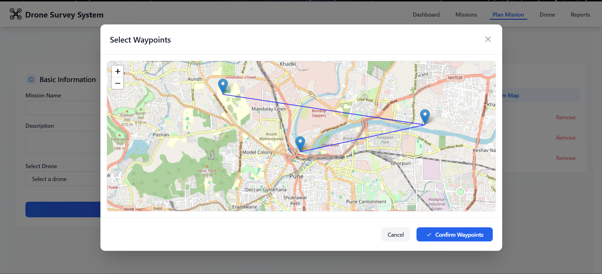
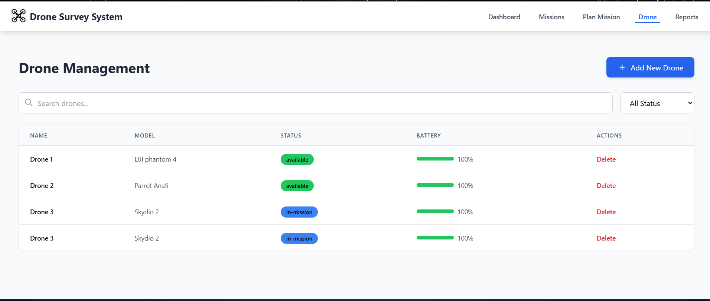
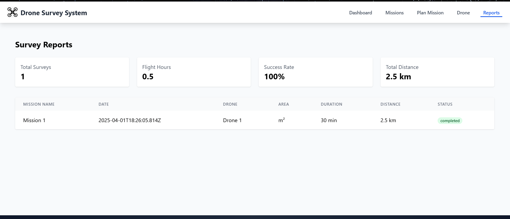
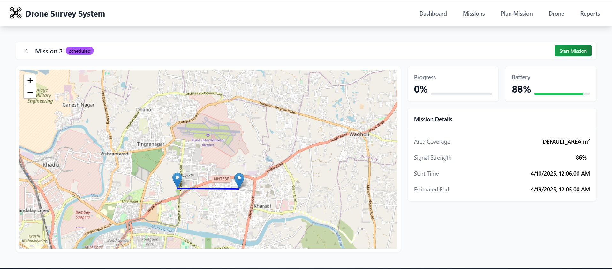
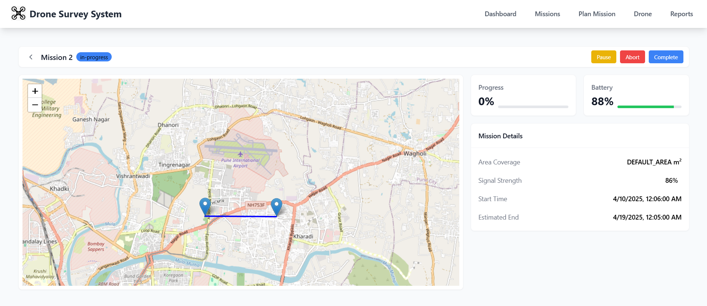

# Drone Survey Management System

A comprehensive and robust platform designed to empower corporate facility managers to efficiently plan, manage, and monitor autonomous drone surveys across global locations. The system integrates mission planning, Drone management, real-time monitoring, and comprehensive reporting into one intuitive solution.

## Key Features

- **Mission Planning**  
  Easily define survey areas, create optimized flight paths, and schedule single or recurring missions.

- **Drone Management**  
  Centralized dashboard to monitor drone inventory, real-time statuses, and key performance metrics.

- **Mission Monitoring**  
  Real-time tracking of drone missions via an interactive Leaflet map, enabling control and adjustments during flight.

- **Survey Reporting**  
  Detailed mission reports including flight statistics, analytics, and actionable insights.

## Tech Stack

### Frontend

- **React** (Vite-powered for rapid development)
- **Tailwind CSS** for responsive and clean UI
- **React Router** for smooth client-side routing
- **Leaflet** (React-Leaflet) for interactive mapping (default OpenStreetMap tiles)
- **Axios** for efficient API calls

### Backend

- **Node.js** with **Express** for scalable backend APIs
- **SQLite** via **Sequelize** 

## Project Structure

```
drone-survey-management/
├── frontend/             # React frontend application
│   ├── public/           # Static files
│   └── src/              
│       ├── components/   # Reusable components
│       ├── pages/        # Page views
│       └── ...           # Additional frontend logic
├── backend/              # Node.js API
│   ├── config/           # Config files (database, env)
│   ├── controllers/      # API controllers
│   ├── models/           # Database schemas
│   ├── routes/           # API routes
│   └── server.js         # Server entry point
├── .env.example          # Example environment config
├── package.json          # Root-level package.json
└── README.md             # Project documentation
```

## Getting Started

### Prerequisites

- [Node.js](https://nodejs.org/) (v14+)
- [npm](https://www.npmjs.com/)

### Installation

1. **Clone Repository**

   ```bash
   git clone https://github.com/yourusername/drone-survey-management.git
   cd drone-survey-management
   ```

2. **Backend Setup**

   ```bash
   cd backend
   npm install
   ```

   Create `.env` file in `backend`:

   ```env
   NODE_ENV=development
   PORT=5005
   DB_NAME=drone_survey
   DB_USER=root
   DB_PASS=
   DB_HOST=localhost
   DB_DIALECT=sqlite
   DB_STORAGE=./database.sqlite
   ```

3. **Frontend Setup**

   ```bash
   cd ../frontend
   npm install
   ```

   *Mapping Configuration*: Modify map settings if needed (`frontend/src/pages/MissionMonitoring.jsx`). Leaflet with OpenStreetMap requires no API key by default.

4. **Root Setup (Optional)**

   To concurrently run frontend and backend:

   ```bash
   npm install
   npm run dev
   ```

## Running the Application

- **Concurrently (Recommended):**

  ```bash
  npm run dev
  ```

- **Separately:**

  **Backend:**

  ```bash
  cd backend
  npm run dev
  ```

  **Frontend:**

  ```bash
  cd frontend
  npm run dev
  ```

Open [http://localhost:5173](http://localhost:5173) in your browser.

## Usage Overview

- **Dashboard:** Drone and mission summaries
- **Mission Planning:** Create configurable missions
- **Mission Monitoring:** Real-time drone tracking
- **Survey Reporting:** Detailed analytical reports
- **Drone management:** Managing drone information

## Production Considerations

- **Database:** Migrate to PostgreSQL or another robust database
- **Security:** Implement advanced authentication and authorization
- **Real-Time Updates:** Add WebSocket support
- **Data Handling:** Implement robust pipelines for processing imagery and sensor data

## License

Licensed under the [MIT License](LICENSE).

---

Optimize your drone survey operations with this intuitive and powerful management solution.

## Project Working Screenshots

### Screenshot 1


### Screenshot 2


### Screenshot 3


### Screenshot 4


### Screenshot 5


### Screenshot 6


### Screenshot 7


### Screenshot 8


### Screenshot 9



